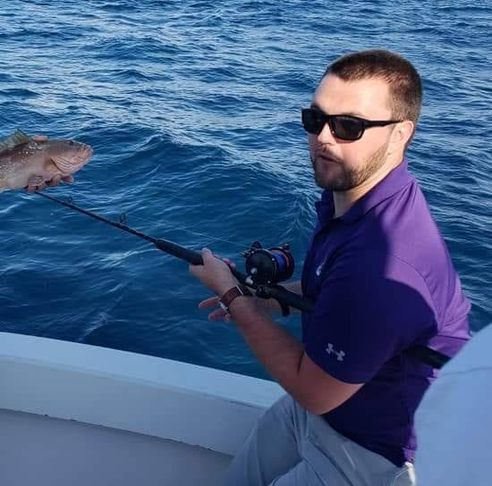

<html lang="en">

     <header> 
	 <link href="main.css" rel="stylesheet" type="text/css">
	 <title>A2 p1</title>
 	 <meta charset="utf-8" />	 
	<a href="index.html">Page 1</a>
	<a href="page2.html">Page 2</a>
	 </header>
	  

			

			<section>
				
				

				 
				My name is Taylor Cook, and I am in my last semester of college as an MIS major.  
				I decided to take MIS after a number of different majorscuurrently have an internship 
				at Union Pacific, where I work in IT on a special project team, deploying thousands of 
				computers out to all of the employees after doing something we call a "BILD" process.  
				 
				 
				Outside of work and school, I live at home with my girlfriend Maddy, coach youth sports, 
				and build computers. I am from Omaha and have never lived anywhere else, but do have 
				aspiration to move somewhere with less harsh of winters. 
				

				</section>
			

</html>
