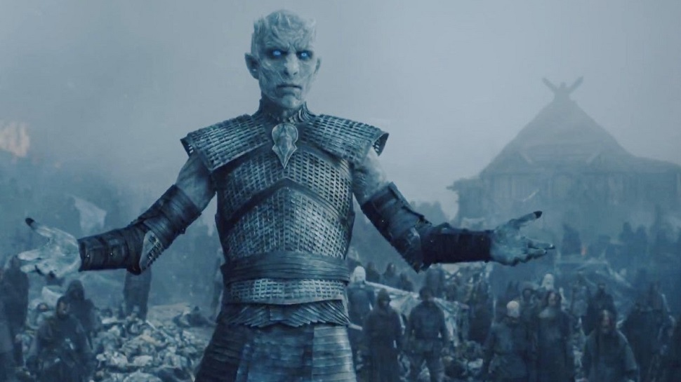

<!DOCTYPE html>

<html lang="en">

     <header> 
	 <link href="main.css" rel="stylesheet" type="text/css">
	 <title>A2 p2</title>
 	 <meta charset="utf-8" />	 
	 <h2>Activity 2 Page 2</h2>
	 </header>
	  
	 

	 

			<section>
				

				 
				I have a slightly unpopular opinion how Game of Thrones will end, but I believe that Cersei
				will send her troops up to "help" everyone else in the battle against the White Walkers.
				However, since she is hiring the golden company, she thinks she will be able to take all of 
				the armies that are north and the white walkers.  This will cause Jon and Daenerys troops to get
				pinched between the two armys and crumble.  Then, I do not think the Golden Company will be able to
				hold against the White Walkers, fall, and the Night's King ends up on the throne.
				

				</section>
			

	 
	 
	 
	 <footer>
	 <a href="index.md">Page 1</a>
	 <a href="Page2.md">Page 2</a>
	 </footer>
	 </html>
